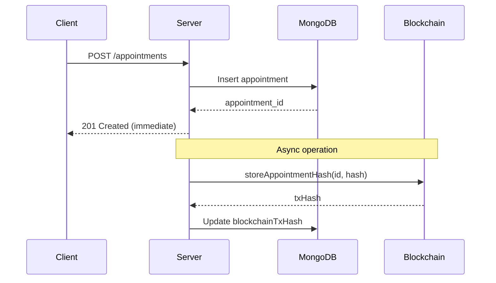
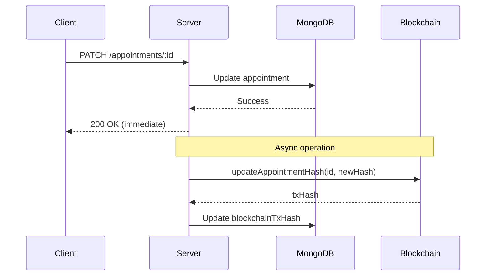
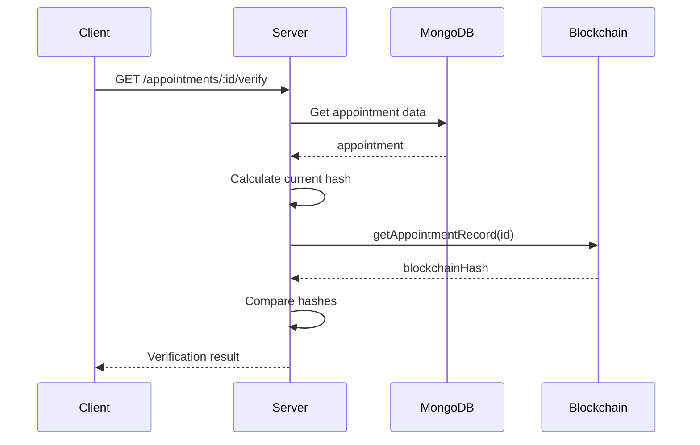

# Blockchain Integration for Appointment Management

## Tổng quan

Hệ thống sử dụng blockchain để đảm bảo tính toàn vẹn dữ liệu của appointments. Mỗi khi tạo hoặc cập nhật appointment:
- **MongoDB**: Lưu dữ liệu chính (nhanh, linh hoạt)
- **Blockchain**: Lưu hash (SHA256) của dữ liệu để chống giả mạo

## Kiến trúc

```
┌─────────────────┐      ┌──────────────────┐      ┌─────────────────────┐
│  Client Request │ ───> │  Express Server  │ ───> │     MongoDB         │
└─────────────────┘      └──────────────────┘      └─────────────────────┘
                                  │                           
                                  ├──── (Async) Store Hash
                                  │                           
                                  ▼                           
                         ┌──────────────────┐                
                         │   Smart Contract │                
                         │   (Blockchain)   │                
                         └──────────────────┘                
```

## Smart Contract

File: `blockchain/contracts/AppointmentRegistry.sol`

**Chức năng chính:**
- `storeAppointmentHash`: Lưu hash lần đầu
- `updateAppointmentHash`: Cập nhật hash khi appointment thay đổi
- `verifyAppointmentHash`: Verify tính toàn vẹn
- `getAppointmentRecord`: Lấy thông tin từ blockchain
- `getAppointmentHistory`: Lấy lịch sử thay đổi

## Cài đặt và Deploy

### 1. Cài đặt dependencies

```bash
npm install ethers
npm install --save-dev hardhat @nomicfoundation/hardhat-toolbox
```

### 2. Khởi tạo Hardhat project

```bash
npx hardhat init
```

Chọn: `Create a TypeScript project`

### 3. Cấu hình Hardhat

Tạo file `hardhat.config.ts`:

```typescript
import { HardhatUserConfig } from "hardhat/config";
import "@nomicfoundation/hardhat-toolbox";
import * as dotenv from "dotenv";

dotenv.config();

const config: HardhatUserConfig = {
  solidity: "0.8.19",
  networks: {
    // Local development (Ganache/Hardhat)
    localhost: {
      url: "http://127.0.0.1:8545"
    },
    // Testnet (ví dụ: Sepolia)
    sepolia: {
      url: process.env.SEPOLIA_RPC_URL || "",
      accounts: process.env.BLOCKCHAIN_PRIVATE_KEY ? [process.env.BLOCKCHAIN_PRIVATE_KEY] : []
    }
  }
};

export default config;
```

### 4. Copy smart contract vào Hardhat

```bash
# Copy contract từ blockchain/contracts sang contracts/
cp blockchain/contracts/AppointmentRegistry.sol contracts/
```

### 5. Tạo deploy script

Tạo file `scripts/deploy.ts`:

```typescript
import { ethers } from "hardhat";

async function main() {
  console.log("🚀 Deploying AppointmentRegistry contract...");

  const AppointmentRegistry = await ethers.getContractFactory("AppointmentRegistry");
  const contract = await AppointmentRegistry.deploy();

  await contract.waitForDeployment();

  const address = await contract.getAddress();
  
  console.log("✅ AppointmentRegistry deployed to:", address);
  console.log("\n📝 Add this to your .env file:");
  console.log(`BLOCKCHAIN_CONTRACT_ADDRESS=${address}`);
}

main()
  .then(() => process.exit(0))
  .catch((error) => {
    console.error(error);
    process.exit(1);
  });
```

### 6. Deploy contract

#### Option A: Local network (Ganache/Hardhat)

```bash
# Terminal 1: Start local blockchain
npx hardhat node

# Terminal 2: Deploy contract
npx hardhat run scripts/deploy.ts --network localhost
```

#### Option B: Testnet (Sepolia)

```bash
npx hardhat run scripts/deploy.ts --network sepolia
```

### 7. Cấu hình Environment Variables

Tạo/cập nhật file `.env`:

```env
# Blockchain Configuration
BLOCKCHAIN_RPC_URL=http://127.0.0.1:8545
BLOCKCHAIN_PRIVATE_KEY=<your-wallet-private-key>
BLOCKCHAIN_CONTRACT_ADDRESS=<deployed-contract-address>
```

**Lưu ý:**
- Local: Dùng private key từ Ganache hoặc Hardhat node
- Testnet: Dùng wallet thật (có test ETH)

## API Endpoints

### 1. Tạo Appointment (tự động lưu lên blockchain)

```http
POST /appointments
Content-Type: application/json

{
  "patientId": "...",
  "doctorId": "...",
  "serviceIds": ["..."],
  "appointmentDate": "2024-01-15",
  "appointmentStartTime": "09:00",
  "appointmentEndTime": "10:00"
}
```

**Response:**
```json
{
  "message": "Create appointment successfully",
  "appointment_id": "..."
}
```

Hệ thống tự động:
1. Lưu vào MongoDB
2. Tính SHA256 hash
3. Gửi hash lên blockchain (async)
4. Cập nhật `blockchainHash` và `blockchainTxHash` vào MongoDB

### 2. Verify Tính toàn vẹn

```http
GET /appointments/:appointment_id/verify
```

**Response (Valid):**
```json
{
  "success": true,
  "appointmentId": "...",
  "isValid": true,
  "currentHash": "0xabc123...",
  "blockchainHash": "0xabc123...",
  "message": "✅ Data integrity verified successfully",
  "blockchainInfo": {
    "blockchainHash": "0xabc123...",
    "blockchainTxHash": "0xtx123...",
    "blockchainVerified": true
  }
}
```

**Response (Tampered):**
```json
{
  "success": true,
  "appointmentId": "...",
  "isValid": false,
  "currentHash": "0xabc123...",
  "blockchainHash": "0xdef456...",
  "message": "Data has been tampered with!",
  "warning": "⚠️ DATA INTEGRITY VIOLATION: This appointment has been tampered with!"
}
```

### 3. Lấy Lịch sử thay đổi từ Blockchain

```http
GET /appointments/:appointment_id/blockchain-history
```

**Response:**
```json
{
  "success": true,
  "appointmentId": "...",
  "history": [
    "0xhash1...",
    "0xhash2...",
    "0xhash3..."
  ],
  "message": "Found 3 change(s) on blockchain"
}
```

## Workflow Chi tiết

### Tạo Appointment



### Update Appointment



### Verify Integrity



## Cách hoạt động của Hash

Dữ liệu được hash (fields quan trọng):
```typescript
{
  _id: "appointment_id",
  patientId: "patient_id",
  doctorId: "doctor_id",
  serviceIds: ["service1", "service2"],
  appointmentDate: "2024-01-15",
  appointmentStartTime: "09:00",
  appointmentEndTime: "10:00",
  price: 1000,
  status: "confirmed"
}
```

Process:
1. Sort keys alphabetically
2. JSON.stringify()
3. SHA256 hash
4. Result: `0xabc123...`

**Lưu ý:** Các fields không quan trọng như `note`, `history` không được hash để tránh false positive.

## Testing

### 1. Test tạo appointment

```bash
curl -X POST http://localhost:4000/appointments \
  -H "Content-Type: application/json" \
  -d '{
    "patientId": "...",
    "doctorId": "...",
    "serviceIds": ["..."],
    "appointmentDate": "2024-01-15",
    "appointmentStartTime": "09:00",
    "appointmentEndTime": "10:00"
  }'
```

### 2. Test verify

```bash
curl http://localhost:4000/appointments/<appointment_id>/verify
```

### 3. Test tamper detection

```javascript
// Trong MongoDB, thay đổi appointment manually:
db.appointments.updateOne(
  { _id: ObjectId("...") },
  { $set: { price: 999999 } }
)

// Sau đó verify sẽ báo "tampered"
```

## Troubleshooting

### Contract chưa deploy

```
⚠️ BLOCKCHAIN_CONTRACT_ADDRESS not found. Please deploy contract first.
```

**Giải pháp:** Deploy contract theo hướng dẫn ở trên.

### Private key không hợp lệ

```
❌ Failed to initialize blockchain service
```

**Giải pháp:** Kiểm tra `BLOCKCHAIN_PRIVATE_KEY` trong `.env`.

### Blockchain service disabled

```
⚠️ Blockchain service not ready. Skipping hash storage.
```

**Giải pháp:** Kiểm tra config trong `.env` và đảm bảo blockchain node đang chạy.

## Best Practices

1. **Async Operations**: Hash được lưu async để không làm chậm response
2. **Error Handling**: Lỗi blockchain không làm fail request chính
3. **Critical Fields Only**: Chỉ hash các fields quan trọng
4. **Immutable History**: Blockchain giữ lịch sử tất cả changes
5. **Gas Optimization**: Chỉ lưu hash, không lưu toàn bộ data

## Security

- Private key KHÔNG BAO GIỜ commit vào Git
- Sử dụng environment variables
- Testnet cho development, Mainnet cho production
- Regular audit smart contract code

## Cost Analysis

### Local/Testnet (Development)
- **Cost**: FREE (test ETH)
- **Speed**: Instant
- **Use case**: Development, testing

### Mainnet (Production)
- **Cost**: ~0.0001-0.001 ETH per transaction (~$0.20-$2.00)
- **Speed**: 12-15 seconds per block
- **Use case**: Production với data quan trọng

## Alternatives

Nếu chi phí blockchain cao, có thể:
1. Batch multiple appointments vào 1 transaction
2. Chỉ lưu appointments quan trọng (emergency, high-value)
3. Sử dụng L2 solutions (Polygon, Arbitrum) để giảm gas fees
4. Sử dụng private blockchain (Hyperledger, Quorum)

## Future Enhancements

- [ ] Batch hashing để giảm chi phí
- [ ] IPFS integration để lưu full data
- [ ] Multi-signature verification
- [ ] Smart contract upgrades
- [ ] Event listening và auto-sync
